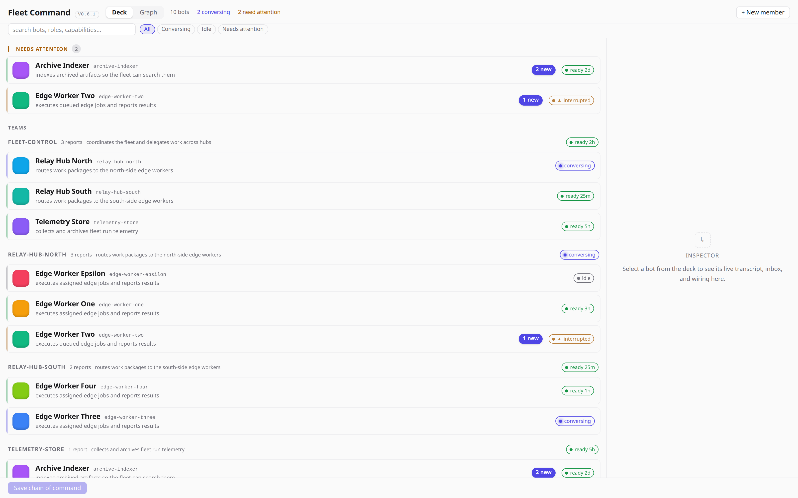
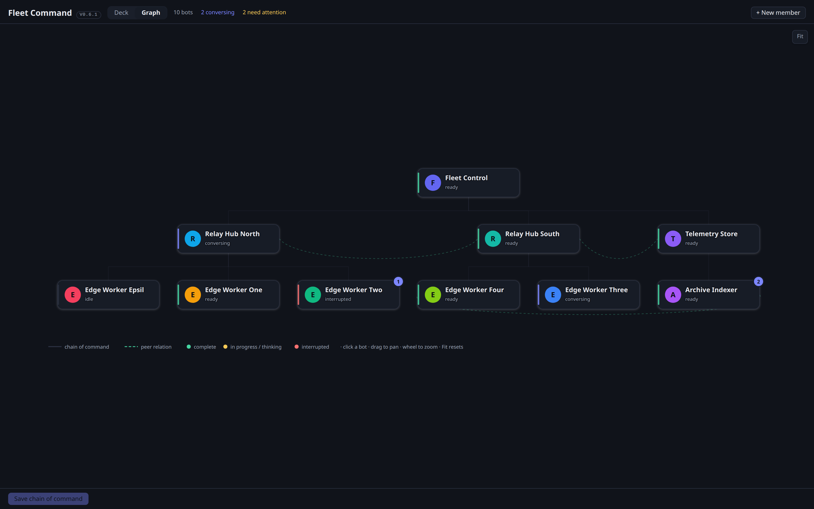

# Fleet Graph

The org chart **is** the interface. A Hermes desktop plugin that renders your
bot fleet's chain of command as an interactive graph, lets you rewire it live,
and tails each bot's activity without opening a single terminal.




## Features

- **Graph canvas** — layered DAG of supervisor/subordinate relations with
  peer edges drawn dashed. A fresh graph auto-fits all nodes; use **Fit** to
  recover after panning or zooming. Pan (drag), zoom (wheel, 0.4×–2× around
  the cursor), and click any bot to open its live transcript drawer. A valid
  operator viewport persists across sessions and is never overwritten by the
  mount default.
- **Deck view (v0.8.0 Fleet Command)** — team-grouped card deck: NEEDS
  ATTENTION triage pile, TEAMS (one header per supervisor with capability),
  UNASSIGNED with "attach under…" selects. Cards carry identity + capability
  line (from the roster), a status chip (`conversing` / `ready 2h` /
  `interrupted` / `idle`) and the unread pill. Clicking a card opens the
  **docked inspector** (slide-over on the graph canvas) with five tabs:
  **Live** (4s-polling transcript), **Inbox** (messages + mark-all-read),
  **Message** (framed composer — see below), **Configure**
  (supervisor/reports/peer editors), **SOUL** (editor). Search filters by
  name/title/capability keeping ancestor chains; status chips filter All /
  Conversing / Idle / Needs attention. Deck and Graph share the same live
  topology draft, so an unsaved rewire is visible in both views immediately.
  The bottom save bar commits all draft edits as one atomic PUT.
- **Message composer (v0.8.0)** — open a framed conversation with any bot from
  its inspector: `talk` (bot → a peer; when it has several peers, pick the
  recipient — validated server-side against the peer list, so edges can't be
  faked), `delegate` (orchestrator → bot; the receiving bot splits work
  downward itself per the initiative ladder), `supervisor` (bot → its
  supervisor). Recipients resolve server-side from the live graph; empty text
  and unknown frames are refused (422). Delivery is inbox-only — no live-turn
  boot from UI clicks.
- **Live activity** — status dot per bot (`complete` / in-progress /
  `interrupted`) from its latest session, plus gateway-event pulses while a
  bot is actively working. Completed gateway turns invalidate the selected
  transcript immediately; the tail drawer still polls every 4 s as a fallback.
- **Built-in profile deletion sync** — the Hermes Bots/Profiles inventory is
  authoritative. If a profile is deleted there, the next overview refresh
  removes its graph node, hierarchy edges, supervisor/attach/start-from
  options, and deck card. Existing reports are retained and become roots;
  stale open-tab saves cannot resurrect the deleted profile.
- **Inbox read-state** — unread badges computed against a per-profile
  watermark; click a badge or "Mark all read" to clear. New messages after
  marking correctly re-light the badge.
- **Rewire inline** — change supervisors, attach/detach reports, add/remove
  peer relations; draft edits save atomically via one PUT. In Configure,
  **remove from hierarchy** removes a leaf/root graph node while retaining
  its profile folder for later adoption or manual reattachment; members with
  first, and **demote to root** remains available through the supervisor
  picker.
- **Create and adopt members** — full dialog mirroring Bots "New Agent":
  SOUL.md, description, model, skills + toolsets at birth. New members can
  clone any existing Hermes profile from the canonical profile inventory;
  cloning passes `clone_from` through `profiles.create` so the source config,
  skills, and persona are copied by Hermes itself. If a profile already exists
  but is not wired into Fleet Graph, **Adopt & wire in** attaches it without
  recreating it and applies only the explicit edits made in the dialog.
- **SOUL editing** — per-bot SOUL.md editor (default profile protected).
- **Semantic routing** — `GET /api/plugins/fleet-graph/match?q=<task>&top=N`
  ranks the fleet by capability similarity (local fastembed embeddings,
  zero API cost). `GET /roster` exposes every bot's derived capability doc
  (title/summary/keywords/toolsets from profile.yaml + SOUL.md + config).
- **Fleet workflows** — **Review advisor** shows bounded coarse local signals and
  review-only recommendations; **Build hierarchy** previews a validated graph
  diff, then requires a separate **Approve & apply hierarchy** action. Neither
  workflow sends raw transcripts or credentials, and neither creates profiles
  automatically.
- **Discussion glow** — edges between bots that exchanged inbox messages in
  the last 5 minutes animate with flowing accent dashes (`/traffic` feed,
  polled every 5 s), in both graph and tree views.

## Initiative ladder (injected into every bot's system prompt)

The plugin's prompt section tells each agent where it sits in the chain and
gives it a 6-step initiative ladder: report done → escalate after >15 min
blocked → hand off out-of-domain requests upward with `/match` evidence →
route info/action needs by roster owner → update peers on urgent needs →
otherwise stay silent.

## Known limitations

- Profile **deletion does not prune** inboxes or read watermarks — graph nodes,
  hierarchy edges, and relation choices are reconciled automatically; stale
  inbox/watermark files remain for manual retention or cleanup.
- Concurrent graph PUTs are serialized by a cross-process file lock and
  **merge** over the stored topology: nodes absent from the payload keep
  their state, removals require an explicit `remove: [name]` list, and
  `supervisor: null` explicitly clears (demote to root). A stale client can
  no longer wipe nodes, and external scripts no longer need a re-GET dance —
  though re-GET before write is still good hygiene.
- Backend edits (`plugin_api.py`) require an app restart; only the desktop
  frontend hot-reloads. The serve backend's port can change across
  restarts — resolve it from the process, don't hardcode it.
- SDK popup/portal components resolve the desktop app's `--color-*` token
  namespace; plugin-owned canvas and text styles resolve `--ui-*`. Custom host
  themes must expose both namespaces, as the desktop does.
- Semantic-match quality tracks SOUL.md specificity; canvas perf tested to
  23–26 nodes (~700ms mount), untested beyond.
- `/send` frames are an enum (`talk` / `delegate` / `supervisor`); the
  recipient for talk must be one of the target's declared peers.

## Install

Fleet Graph is a **unified Hermes plugin package** with two runtime pieces:

- Python dashboard backend: `dashboard/manifest.json` + `dashboard/plugin_api.py`.
- Raw ESM desktop UI: `desktop-plugin/plugin.js`.

The runtime package is already supplied by Hermes. Plugin users do **not** need
Node, npm, `npm ci`, pytest, Ruff, `ty`, or a development Python environment.
Do not install `tests/` dependencies.

### Preferred agent/CLI install

Use Hermes to install the plugin instead of copying an archive by hand. This keeps
the plugin under the correct Hermes home, runs Hermes' install-time security
scan, records the source/revision, and enables the backend explicitly.

```bash
# Pin the verified Fleet Graph v0.8.0 tree for reproducible installation.
FLEET_GRAPH_REF="f4c8e9cf4212316dfec3daf654915411c7a84576"
hermes plugins install asmodaydoescoding/fleetgraph \\
  --ref "$FLEET_GRAPH_REF" \\
  --enable

HERMES_HOME="${HERMES_HOME:-$HOME/.hermes}"
PLUGIN_DIR="$HERMES_HOME/plugins/fleet-graph"

# Fail closed if the repository was installed at the wrong level.
test -f "$PLUGIN_DIR/plugin.yaml"
test -f "$PLUGIN_DIR/dashboard/manifest.json"
test -f "$PLUGIN_DIR/dashboard/plugin_api.py"
test -f "$PLUGIN_DIR/desktop-plugin/plugin.js"

DESKTOP_DIR="${HERMES_HOME}/desktop-plugins/fleet-graph"
mkdir -p "$DESKTOP_DIR"
ln -sfn "$PLUGIN_DIR/desktop-plugin/plugin.js" "$DESKTOP_DIR/plugin.js"

hermes plugins list --user --enabled --plain
```

The `desktop-plugin/plugin.js` symlink is intentional: this release stores its
UI entry under `desktop-plugin/`, while Hermes' standalone desktop loader
expects `$HERMES_HOME/desktop-plugins/<id>/plugin.js`. Do not copy the entire
repository into `$HERMES_HOME/desktop-plugins/`; that produces the wrong
layout. The symlink is safe to repeat.

If installing the moving branch instead of the verified tree, omit `--ref`:

```bash
hermes plugins install asmodaydoescoding/fleetgraph --enable
```

### Manual extracted-archive install

If an agent has only a downloaded Fleet Graph archive, extract it first and set
`SOURCE_DIR` to the directory that directly contains `plugin.yaml` and
`dashboard/manifest.json` (GitHub source archives normally add one outer
`fleetgraph-<ref>/` directory). Then run:

```bash
HERMES_HOME="${HERMES_HOME:-$HOME/.hermes}"
PLUGIN_DIR="$HERMES_HOME/plugins/fleet-graph"
mkdir -p "$PLUGIN_DIR"
cp -a "$SOURCE_DIR/." "$PLUGIN_DIR/"
hermes plugins enable fleet-graph
mkdir -p "$HERMES_HOME/desktop-plugins/fleet-graph"
ln -sfn "$PLUGIN_DIR/desktop-plugin/plugin.js" \\
  "$HERMES_HOME/desktop-plugins/fleet-graph/plugin.js"
```

Verify the same four `test -f` checks from the preferred install before
starting Hermes. Do not point Hermes at the outer archive directory.

### Activate the installed plugin

1. In Hermes Desktop, run **Reload desktop plugins** from the command palette.
2. If Fleet Graph reports that routes are not mounted, click **Remount routes**.
   Hermes with route-remount protocol v1 applies the change without a backend
   restart.
3. On older Hermes versions without that RPC, restart the dashboard once (for
   example `systemctl --user restart hermes-dashboard.service` on Linux), then
   press **Retry**.

Backend enablement and desktop loading are separate gates: `plugins.enabled`
allows the Python API to import, while the desktop reload loads the raw UI
entry. Both are required for the full plugin.

## Configuration

Fresh installs start with an empty topology. Discovered profiles appear as
unassigned until the operator wires them; no developer fleet names or peer
relations are seeded.

## Optional starter packs and skills

The release includes the inert `starter-packs/starfleet-complement/` pack. It
is optional and never installs profiles silently. Preview its manifest,
license, attribution, profile names, and topology first; selected new profiles
must be created through Hermes `profiles.create` with an explicit `clone_from`,
while profiles already present are adopted and wired rather than recreated.
The pack contains no executable installer or arbitrary code.

Two optional Hermes skills ship under `skills/`:

- `fleet-bot-advisor` — local, coarse activity recommendations using the
  sequence observe → summarize → recommend → ask → create.
- `fleet-hierarchy-builder` — an on-demand draft, graph diff, validation, and
  explicit apply flow for existing profiles.

Both skills are approval-gated and topology/profile-lifecycle changes are
verified by readback.

Operator metadata lives beside the topology in `fleet_graph.yaml` and is not
returned as a graph node:

```yaml
_meta:
  profile_aliases:
    public-node-name: canonical-runtime-profile
  root_owner_label: Operator
```

Deployment and test environments may override the default runtime locations:

| Variable | Purpose |
|---|---|
| `FLEET_HOME` | Base Hermes/fleet home |
| `FLEET_GRAPH_PATH` | Topology YAML path |
| `FLEET_DEFAULT_PROFILE` | Canonical protected/default profile |
| `FLEET_INBOX_DIR` | Fleet inbox and watermark directory |
| `FLEET_PROFILES_DIR` | Hermes profiles directory |
| `FLEET_HERMES_BIN` | Hermes CLI executable |

## Permissions & data access

Read-only access to each profile's `state.db` (session titles/previews/
status via `hermes_state.SessionDB`), read/write to:

- `fleet_graph.yaml` — topology, peer relations, and operator metadata
- `~/.hermes/fleet-inbox/` — fleet message inbox and `.read/` watermarks
- `profiles/<name>/SOUL.md` — only when you edit a soul in the UI

No credentials are read, no network calls leave the machine.

## Internals

| Piece | Path | Role |
|---|---|---|
| UI | `desktop-plugins/fleet-graph/plugin.js` | Single-page plugin (Deck/Graph views, inspector, dialogs) |
| Backend | `dashboard/plugin_api.py` | FastAPI router mounted at `/api/plugins/fleet-graph/` |
| Core | `fleet_graph_core.py` | Topology SSOT: load/save/describe/simulate |
| Messaging | `fleet_msg.py` | CLI for inter-bot messages (powers the inbox) |
| Tests | `tests/public_integration_test.py`, `tests/` | Hermetic end-to-end integration suite plus static, configurability, adversarial backend, and nine frontend harnesses |

### Endpoints

| Route | Purpose |
|---|---|
| `GET /overview[?light=1]` | Full paint payload; `light=1` skips session DB reads |
| `GET /graph/summary` | Node/edge counts + status histogram (header strip) |
| `PUT /graph` | Replace topology + relations from editor drafts |
| `GET /relations` | Peer map |
| `GET /inbox/{p}` · `POST /inbox/{p}/read` | Inbox + watermark mark-read (supports `{ts}` / `{count}`) |
| `GET /soul/{n}` · `PUT /soul/{n}` | SOUL.md read/write (default profile blocked) |
| `GET /avatar/{n}` | Profile avatar as data URL |
| `GET /sessions/tail[?profile=p]` | Per-bot latest-session snapshot |
| `GET /sessions/{n}/messages?limit=` | Transcript tail for the live drawer |
| `POST /simulate` | Chain-of-command permission simulation |
| `GET /traffic?window=` | Recent inter-agent traffic for animated edge glow |
| `GET /roster` · `GET /match?q=&top=` | Capability roster and semantic routing |
| `GET /starter-packs` | List validated optional inert starter packs |
| `GET /starter-packs/{id}` | Read-only pack preview with adoption/create state |
| `POST /starter-packs/{id}/selection` | Validate selected profile actions without mutation |
| `GET /workflows` · `GET /advisor/preview` | Shipped workflow descriptors and coarse advisor review |
| `POST /hierarchy/preview` | Validate a staged hierarchy and return a read-only diff |
| `PUT /hierarchy/apply` | Apply a hierarchy only with explicit `confirm: true` |
| `POST /send` | Validated `talk` / `delegate` / `supervisor` inbox delivery |

## Development

Render harnesses (real React + stubbed SDK, drive every UI branch):

```bash
cd tests
[ -d node_modules ] || npm ci

node drive-harness.mjs     # expect: ALL BRANCHES DRIVEN
node hostile-harness.mjs   # expect: ALL HOSTILE BRANCHES DRIVEN
node loop2-harness.mjs     # create-dialog guards        (6 passed)
node loop5-harness.mjs     # optimistic-UI rollback      (4 passed)
node loop6-harness.mjs     # deck v2                     (17 passed)
node loop7-harness.mjs     # composer recipient contract (19 passed)
node loop8-harness.mjs     # release adversarial/state seams (33 passed)
node render-harness.mjs    # full render sweep           (ALL BRANCHES DRIVEN)
node boundary-harness.mjs  # error boundary              (caught + reload present)
```

Integration and backend suites:

```bash
python3 tests/public_integration_test.py       # hermetic end-to-end suite; expect INTEGRATION SUMMARY with 0 failed
python3 tests/backend_loop8_test.py            # expect BACKEND LOOP8 SUMMARY: 23 passed, 0 failed
python3 tests/configurability_test.py          # expect CONFIGURABILITY SUMMARY: 21 passed, 0 failed
```

Static audit (parse, loader-import count, token/key hygiene):

```bash
python3 tests/a1_audit.py
# expect: PARSE OK · loader imports: 3 · token/key findings: 0
```

Design tokens live in one block (`TOKENS_CSS`) at the top of `plugin.js`,
derived from host theme tokens (semantic color vars, 150 ms fast / 300 ms
medium motion bands). Runtime literals are rejected by the configurability
gate.

## Deferred operator decisions

- Whether profile deletion should automatically prune topology, inboxes, and
  read watermarks.
- Whether graph writes should gain optimistic concurrency/ETags instead of the
  documented last-write-wins contract.
- Whether to optimize or virtualize the graph beyond the verified 26-node
  range.

## Loader contract (for editors)

The published Hermes Desktop loader uses a syntax-anchored matcher for
static, side-effect, and dynamic ESM imports; it is not a full JavaScript
parser. Keep module imports limited to the host-supported SDK and React
surfaces, and avoid placing import-declaration-shaped examples in plugin
comments or strings. Verify after edits:

```bash
node --check desktop-plugins/fleet-graph/plugin.js
python3 tests/a1_audit.py
# Expected: PARSE OK, loader imports: 3, token/key findings: 0
```
